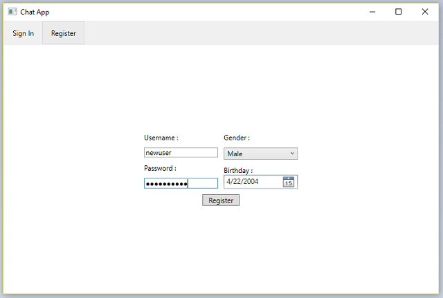
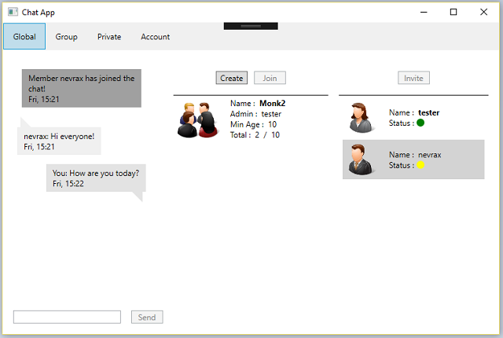
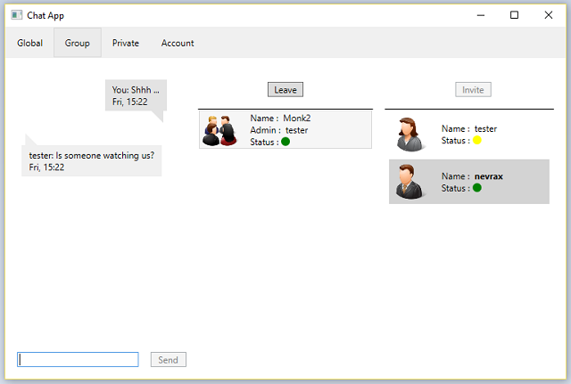

# Chat Application (Client-Server) #

A distributed chat application written in **C#** and using the **DOT.NET v4.6 framework** to create a duplex connection between server and client. Build only for **Windows** using the advanced features for layout design (**Windows Presentation Foundation**) and communication protocol (**Windows Communication Foundation**). The application also benefits from a **secure message transmission channel**. 

## Introduction

The chat application maintains 3 rooms with different levels of visibility for members: global romm, group room and private room. As the name suggests, global room contains a single chat conversation between all the members logged on the server and a list of created group rooms and the ability to start a private conversation with another member. The group room offers chat visibility only to members who were accepted to join the group room and the leader has the ability to kick-out members from the group. Finally, the private room contains a list of conversations with different members from the server. The GUI is design to be simple and easy to understand from the first attempt. The interface handles all user errors and ensures the responsiveness accuracy of the application. 

Below is a list of the features implemented in the application:

- Option to select a different server
- Register/Connect members
- Group chat with one member as the leader
- Asymmetric message encryption
- History of conversations after chat become inactive
- Idle status of members reported in chat
- Reconnect with another account
- Kick out from chat members with a bad behavior

## Requirements

The list below contains the minimum requirements to build and run the applications:

- Visual Studio 2015 - development environment
- DOT.NET v4.6 - framework for WPF and WCF features
- Win32 OpenSSL v1.1 - generate certificates for channel encryption

## Screenshots

